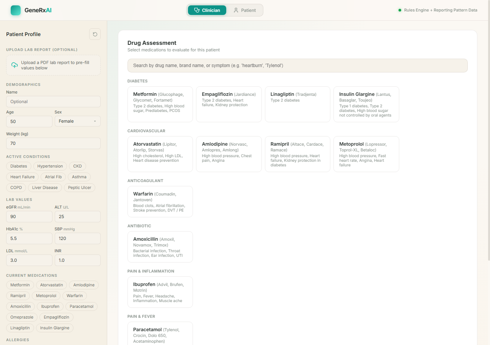
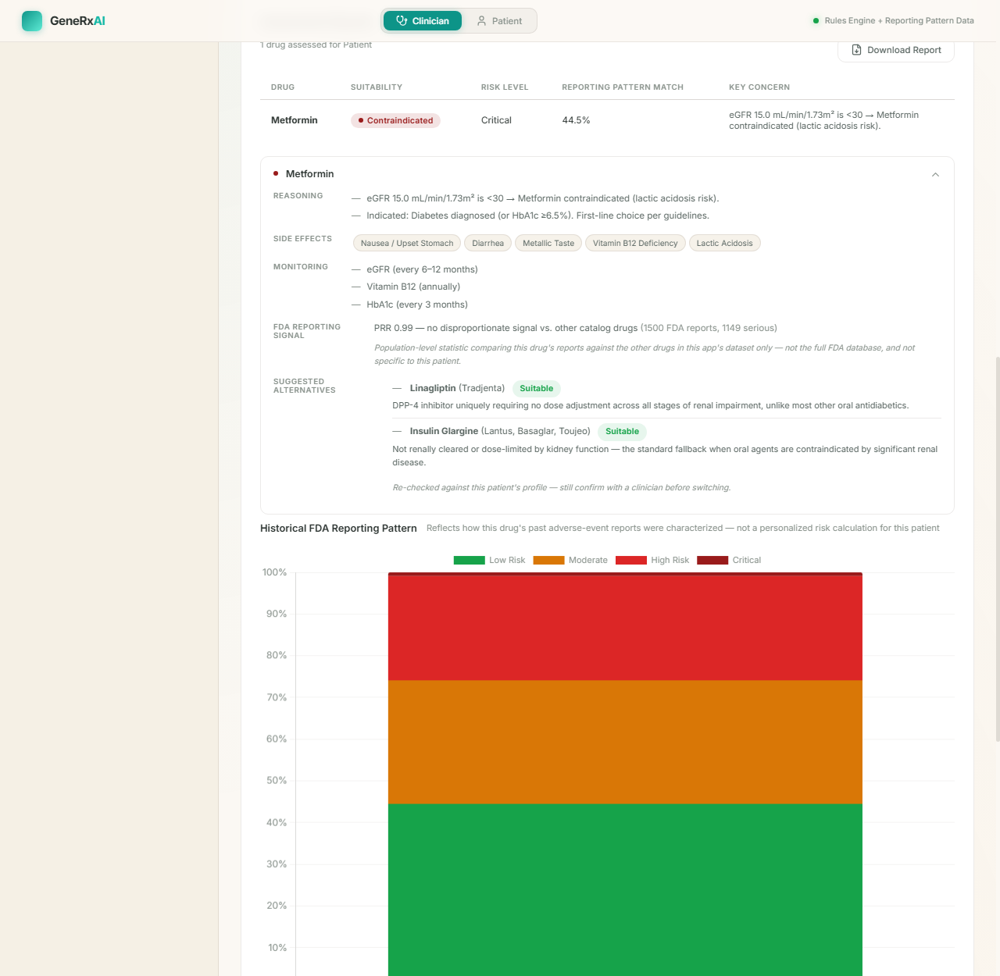
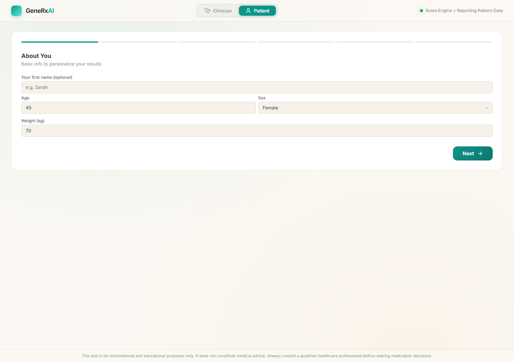

# 💊 GeneRx AI

[](https://www.python.org/)
[](https://fastapi.tiangolo.com/)
[](https://xgboost.readthedocs.io/)
[](https://pytorch.org/)
[](#license)

> Forked from [scara0301/GeneRx-AI](https://github.com/scara0301/GeneRx-AI) — original work by Anirudh, KOUK-78, and Koushik S. This fork extends that project with the features described below.

Clinical drug safety assessment for a specific patient — not generic drug information. Given a patient's demographics, conditions, labs, current medications, and allergies, GeneRx AI evaluates how suitable a given drug is *for that patient*, combining an evidence-based rules engine with real FDA adverse-event data.

<p align="center">
  
</p>

## What It Does

- **Clinical Rules Engine** — deterministic, evidence-based checks (renal dose adjustment, allergy contraindications, drug-drug interactions, condition-specific warnings) that produce a suitability verdict: Suitable / Caution / Avoid / Contraindicated, with human-readable reasoning, concrete dose guidance, and monitoring recommendations. **This is the primary safety mechanism** — see [Safety Design](#safety-design) below for why.
- **Alternative-Medication Suggestions** — when a drug is Avoid/Contraindicated, candidate alternatives are re-evaluated against the *same patient's* profile before being suggested, so a substitute that would itself be unsafe is never shown.
- **PDF Lab Report Upload** — upload a lab report PDF and have eGFR, ALT/AST, HbA1c, LDL, INR, age, and sex auto-filled into the form, with unit-safety handling (e.g. mg/dL → mmol/L for cholesterol) and a mandatory review step before any value feeds an assessment.
- **Report-Based Drug Suggestions** — after a report is parsed, relevant drug categories are highlighted and likely conditions (diabetes, hypertension, high cholesterol) are pre-checked based on the actual lab thresholds.
- **ML Risk Model** — XGBoost vs. a PyTorch neural network, benchmarked against each other on real FAERS data, with the better performer (by macro F1, not raw accuracy) automatically selected and served.
- **FDA Reporting Signal (PRR)** — a proper pharmacovigilance disproportionality statistic (Proportional Reporting Ratio + chi-square, Evans criteria), computed per drug and shown separately from the per-event ML output — see below for why these are two different things.
- **Symptom / Brand-Name Search** — find a drug by generic name, common brand name ("Tylenol", "Crocin"), or symptom ("heartburn").
- **Clinician & Patient Modes** — a full clinical form for prescribers, and a plain-language step-by-step wizard for patients.
- **Downloadable Clinical Report** — a plain-text summary of the full assessment for a patient encounter.

<p align="center">
  
</p>

<p align="center"><em>Metformin flagged Contraindicated at low eGFR — alternatives are re-checked against the same patient before being suggested, and the FDA Reporting Signal (PRR) is shown separately from the per-event pattern match.</em></p>

<p align="center">
  
</p>

<p align="center"><em>Patient mode: the same rules engine, presented as a plain-language wizard with no medical jargon.</em></p>

## Safety Design

This project deliberately separates three different kinds of signal, because collapsing them together is how a tool like this becomes misleading:

| Signal | What it actually is | Varies per patient? |
|---|---|---|
| **Rules engine verdict** (Suitable/Caution/Avoid/Contraindicated) | Deterministic, evidence-based clinical logic | Yes — this is the real per-patient safety call |
| **"Reporting Pattern Match"** (ML classifier) | How closely this specific event resembles historically severe FAERS reports for this drug | Yes, but reflects *reporting patterns*, not calculated clinical risk |
| **"FDA Reporting Signal"** (PRR) | Does this drug's FAERS reports skew disproportionately severe compared to the other drugs in this app's dataset | **No** — population-level statistic, identical for every patient assessed on that drug |

The ML classifier and the PRR signal are both derived from FAERS — a voluntary, passive adverse-event surveillance system with no population denominator. Neither can answer "how dangerous is this drug," only "how do reports about this drug read" (PRR) or "how does this report compare to past ones" (classifier). The rules engine doesn't have this limitation, which is why it — not the ML output — carries the actual Suitable/Contraindicated verdict.

PRR is intentionally **not** folded into the ML classifier's training target: PRR is a population-level number (constant per drug), and using it as a supervised-learning label would collapse the model into memorizing a drug-name-to-constant lookup, discarding everything the patient-level features (age, concomitant meds, etc.) contribute. They're computed and shown separately instead.

## Architecture

```
backend/
  server.py             → FastAPI REST API
  clinical_engine.py     → Rule-based drug assessment, drug catalog, alternatives engine
  ml_model.py             → Loads and serves the trained risk model
  drug_features.py        → Pharmacology metadata + drug-interaction features (shared by training & serving)
  pharmacovigilance.py    → PRR (Proportional Reporting Ratio) signal detection
  nn_model.py              → PyTorch neural net (GPU-accelerated when available), sklearn-style wrapper
  report_parser.py        → PDF lab report → structured patient fields (pdfplumber, layout-aware)
  fetch_faers.py           → FDA adverse event downloader (openFDA)
  fetch_sider.py            → SIDER side-effect downloader
  build_dataset.py          → Feature engineering pipeline + PRR computation
  train_model.py             → XGBoost vs. neural net training & comparison
  utils.py                    → Clinical severity scoring
frontend/
  index.html               → Single-page application
  style.css                 → Light/warm theme
  app.js                      → Client logic: assessment, upload, search, charts, report download
```

## Quick Start

### Prerequisites
- Python 3.10+
- pip

### Setup

```bash
# Install dependencies (CPU-only PyTorch by default — see below for GPU)
pip install -r requirements.txt

# Fetch data and train the model
python -m backend.fetch_faers
python -m backend.fetch_sider
python -m backend.build_dataset
python -m backend.train_model

# Start servers
python -m uvicorn backend.server:app --port 8000
python -m http.server 3000 --directory frontend
```

Open **http://localhost:3000** in your browser.

Or use the batch script:
```bash
run_app.bat
```

**GPU training:** if you have an NVIDIA GPU, install the CUDA build of PyTorch instead of the CPU wheel (`pip install torch --index-url https://download.pytorch.org/whl/cu128`, adjust the CUDA version to your driver) before running `train_model.py`. Both XGBoost and the neural net will train on GPU automatically when detected — the saved model is always moved back to CPU before being written to disk, so it still loads fine on a GPU-less deployment (e.g. this project's Hugging Face Space).

## Data Sources

| Source | Description | Records |
|--------|------------|---------|
| [openFDA FAERS](https://open.fda.gov/apis/drug/drugadverseevent/) | FDA Adverse Event Reporting System | 15,000 events (1,500 per drug × 10 drugs) |
| [SIDER 4.1](http://sideeffects.embl.de/) | Drug side-effect database (EMBL) | 1,934 drug–side-effect pairs |

## Model Performance

Compared on the same held-out test set, model selection by **macro F1** (not accuracy — `risk_category` is imbalanced, and accuracy alone rewards a model that just predicts the majority class more often):

| Model | Accuracy | Macro F1 |
|---|---|---|
| **XGBoost** (selected) | 58.8% | 0.558 |
| Neural Net (PyTorch MLP) | 41.7% | 0.400 |

XGBoost wins decisively — expected on a small tabular dataset (15k rows, 21 features); gradient-boosted trees consistently outperform small neural nets at this scale. Training features include per-event demographics/reactions, per-drug pharmacology (half-life, hepatic/renal clearance, protein binding, CYP enzymes, black-box warning status), and concomitant-drug interaction counts (NSAID/QT-prolonging/sedative/CYP3A4-inhibitor co-medication), computed by the same code at training and serving time (`drug_features.py`) so the two can't silently drift apart.

**FDA Reporting Signal (PRR):** across the 10 fetched drugs, none currently shows a disproportionate signal by standard criteria (PRR range 0.74–1.24, threshold for a signal is PRR ≥ 2 with χ² ≥ 4). This is itself a meaningful finding — it means these commonly-prescribed drugs report similarly severe outcomes relative to each other, not that any one of them stands out. The PRR comparator is limited to the other drugs in this project's own FAERS pull, not the full FDA database — see [Safety Design](#safety-design).

## API Endpoints

| Endpoint | Method | Purpose |
|---|---|---|
| `/api/health` | GET | API status, active model name, accuracy/macro-F1, model comparison |
| `/api/drugs` | GET | Drug catalog with brand names, indications, FAERS signal |
| `/api/assess` | POST | Full assessment: rules engine + ML + alternatives + response curve + FAERS signal |
| `/api/report` | POST | Plain-text clinical report for an assessment |
| `/api/parse-report` | POST | Upload a PDF lab report, get back structured patient field candidates |
| `/api/interactions` | POST | Drug-drug interaction check only |

## Tech Stack

- **Backend**: FastAPI, XGBoost, PyTorch, scikit-learn, pandas, pdfplumber
- **Frontend**: Vanilla JS, CSS (light/warm theme), Chart.js
- **Data**: openFDA API, SIDER 4.1

## Disclaimer

This tool is for informational and educational purposes only. It does not constitute medical advice. Always consult a qualified healthcare professional before making medication decisions.

Clinical rules and pharmacology data in this project are drafted using well-established, widely-documented facts about common medications, but have not undergone review by a licensed pharmacist or physician. Treat this as a portfolio/educational project, not a validated clinical tool.

## License

MIT
